# ss-aof

Spark本地增量日志流式抓取。

## Environment

linux

zookeeper

spark 3.3.0

jdk 11

## Limitations

只抓取Executor所在节点目录下的数据。

**数据本地性**

当且仅当数据本地性(`Locality level`)为`NODE_LOCAL`时才会抓取该节点的数据，如果无法满足则需要适当提高`spark.locality.wait`。

## Usage

```
spark.readStream.format("com.hx.spark.sql.connector.aof").options(options).option("path", "/foo/directory/service.log.*").load()
```

**参数**

|         名称         | 默认| 选项 | 说明 |
|:------------------:|:---:| --- | --- |
|        path        | | | 目标文件绝对路径, 支持正则 |
| zookeeper.address  | localhost:2181 | | zookeeper地址    |
|  starting.offsets  | earliest | earliest: 文件头, latest: 文件尾 | 初次读取文件时的位置 |
|     bytes.max      | Int.MaxValue | | 每次读取的最大字节数, 防止startingOffsets=earliest时，初次读取过量数据而OOM |
|     meta.store     | /higgs/aof/{监听目录路径}/meta | | 文件的元数据同步节点(zookeeper) |
| meta.await.timeout | 3000 | | driver等待executor同步元数据的超时时长 |
| md5.check.enabled  | true | | 开启MD5校验,通过收集文件前`dm5.sample.length`字节的数据计算MD5,通过该MD5判断文件是否被清空过(违反append-only约束) |
| md5.sample.length  | 1024 | | 计算MD5使用的样本长度 |

支持以`spark.aof.`为前缀通过`--conf`设置。

## 实现

```mermaid
sequenceDiagram

participant driver
participant zookeeper
participant executor


critical 选取初始Offset
  driver -->> driver: 读取本地Offset
  note over driver: LocalOffset,记为LO
  driver ->+ zookeeper: 请求备份Offset
  zookeeper ->>- driver: 返回备份Offset
  note over driver: ZookeperOffset,记为ZO
option LO存在,ZO不存在
  note left of driver: 未记录Offset备份
  driver ->>+ driver: 使用LO
option LO存在/不存在,ZO存在
  note left of driver: Driver切换
  driver ->> driver: 使用ZO
option LO不存在,ZO不存在
  note left of driver: 初次启动
  driver ->>driver: 使用空Offset
end

driver ->> driver: 使用初始Offset作为startOffset

note over driver: GlobalStartOffset

critical 获取Executor文件元数据
  driver ->> driver: 获取Executor的SnifferEndpoint状态
option SnifferEndpoint状态Unknown
  driver -->> zookeeper: ①监听SnifferEndpoint状态节点
  note over driver: Use LaunchSnifferEndpoint<br>(InputPartition)
  driver -->> executor: ②LaunchSnifferEndpoint
  executor ->> executor: ③本地性校验
  executor ->> executor: ④初始化DirectorySnifferEndpoint
  executor ->> executor: ⑤启动SnifferEndpoint
  note right of executor: 省略SnifferEndpoint监听zookeeper节点中driver发起的stop命令,<br>该命令将使endpoint释放相关资源并关闭
  executor -->> zookeeper: ①监听元数据请求节点 
  executor -->> zookeeper: ⑥SnifferEndpoint状态Running
  zookeeper ->> driver: ⑦同步SnifferEndpoint状态
  driver ->> driver: 更新Executor的SnifferEndpoint状态
option SnifferEndpoint状态Running
  driver -->> zookeeper: ②监听元数据请求响应节点
  driver -->> zookeeper: ③请求Executor文件元数据
  zookeeper -->> executor: ④同步元数据请求
  executor ->> executor: ⑤获取节点文件元数据
  executor -->> zookeeper: ⑥返回文件元数据信息
  zookeeper ->> driver: ⑦同步文件元数据信息
end

note over driver: 各Executor的文件元数据

critical 计算GlobalEndOffset并计划分区

note over driver: GlobalStartOffset存在文件偏移信息,记为条件C1
note over driver: GlobalStartOffset不为空,记为条件C2
note over driver: GlobalStartOffset中记录的文件MD5与元数据中MD5一致,记为条件C3
note over driver: GlobalStsartOffset中记录的文件起始偏移小于等于元数据中文件长度,记为条件C4 

option !C1 and C2
  note left of driver: 该文件为动态创建的文件
  driver ->> driver: 以文件开头为endOffset,即0L
option !C1 and !C2
  note left of driver: 初次读取该文件
  driver ->> driver: 根据starting.offsets参数决定endOffset
  alt earliest
    driver ->> driver: 以文件开头为endOffset,即0L
  else latest
    driver ->> driver: 以文件长度为endOffset
  end
option C1 and !C3
  note left of driver: 文件被替换/清空
  driver ->> driver: 以文件开头为endOffset,即0L
option C1 and C3 and !C4
  note left of driver: 文件被截断
  driver ->> driver: 以文件长度为endOffset
option C1 and C3 and C4
  note left of driver: 正常处理中
  note over driver: GloalStartOffset中记录的文件起始偏移+maxBytes,记为V
  note over driver: 文件元数据中文件长度,记为LEN
  alt V > LEN
    driver ->> driver: endOffset = LEN
  else V <= LEN
      driver ->> driver: endOffset = V
  end

driver ->> driver: 所有文件的endOffset构建GlobalEndOffset
driver ->> driver: 记录finalOffset为GlobalEndOffset

critical 分区
note over driver: GlobalStartOffset中文件的起始偏移,记为SO
note over driver: GlobalEndOffset中文件的终止偏移,记为EO
option SO > EO
  note left of driver: 违反append-only约定,endOffset被重置
  driver ->> driver: 修正SO为EO
option SO <= EO
  note left of driver: 根据SO和EO正常分区
  driver ->> driver: 创建AOFSingleFilePartition并通过preferredLocations设置读节点
end
note over driver: 所有节点分区信息
driver ->> executor: 根据preferredLocations分发分区信息(在spark.locality.wait.node超时时间内)
end

executor ->> executor: 初始化AOFPartitionReader
executor ->> executor: 数据本地性校验
executor ->> executor: 按起始偏移和终止偏移读取数据
executor ->> executor: 将数据按行分割,形成InternalRow
executor ->> executor: 关闭文件

executor ->> driver: Commit
driver ->> zookeeper: 写finalOffset作为备份
executor ->> executor: 写相关操作
```

